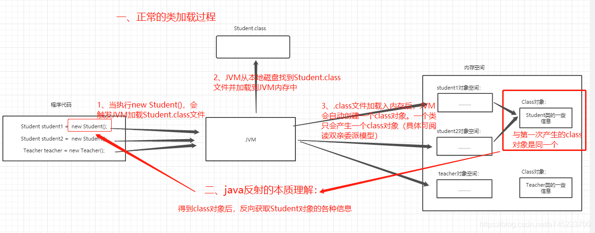

#java 反射学习
1、什么是反射？
    核心：程序运行时动态加载类并获取类的详细信息，从而操作类或对象的属性和方法。
    本质：JVM得到class对象之后，再通过class对象进行反编译，从而获取对象的各种信息。
  注：Java属于先编译再运行的语言，程序中对象的类型在编译期就确定下来了，
  而当程序在运行时可能需要动态加载某些类，这些类因为之前用不到，所以没有被加载到JVM。
  通过反射，可以在运行时动态地创建对象并调用其属性，不需要提前在编译期知道运行的对象是谁。
  
2、反射的原理

3、反射的又优缺点：
    优点：
        在运行时获得类的各种内容，进行反编译，对于Java这种先编译再运行的语言，
        能够让我们很方便的创建灵活的代码，这些代码可以在运行时装配，
        无需在组件之间进行源代码的链接，更加容易实现面向对象。 
    缺点：
        1、反射会消耗一定的系统资源，因此不需要动态创建的对象不需要使用反射；
        2、反射的调用方法是可以忽略权限检查，可能会破坏封装性而导致安全问题。
4、反射的用途：
   1、反编译：.class --> .java 
   2、通过反射机制访问Java的的属性、方法、构造方法、注解等。
   3、当我们在使用IDE,比如Ecplise时，当我们输入一个对象或者类，并想调用他的属性和方法是，
      一按点号，编译器就会自动列出他的属性或者方法，这里就是用到反射。 
   4、最主要的用途是开发通用框架。 为了保证框架的通用性，他们可能需要根据配置文件加载不同的类或者对象，
      调用不同的方法，这个时候就必须使用到反射了，运行时动态加载需要的加载的对象。 
      例如：mybatis mapper 配置文件的 namespace。
           数据库驱动类的加载 Class.forName("com.mysql.jdbc.Driver"); // 动态加载mysql驱动

5、常用反射类

     Java.lang.Class; -->类
     
     Java.lang.reflect.Constructor;-->构造方法
     
     Java.lang.reflect.Field;--->字段
     
     Java.lang.reflect.Method;--->方法
     
     Java.lang.reflect.Modifier; --> 类或者类成员的访问修饰。返回的是一个int类型 整数。具体代表什么需要查看对照表  

6、方式的基本使用  详见代码           