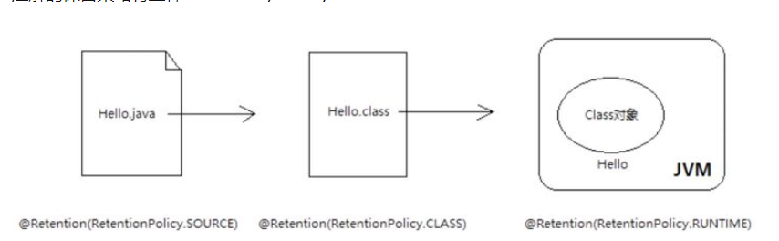
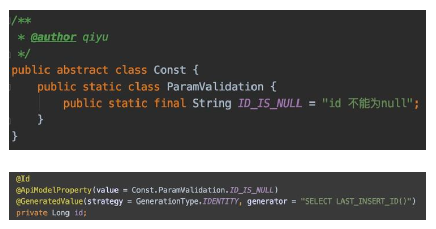
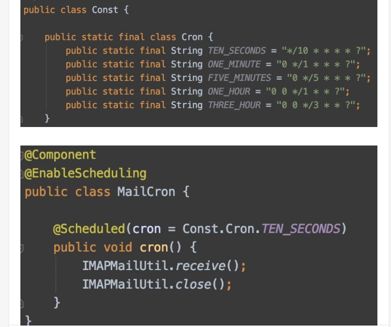
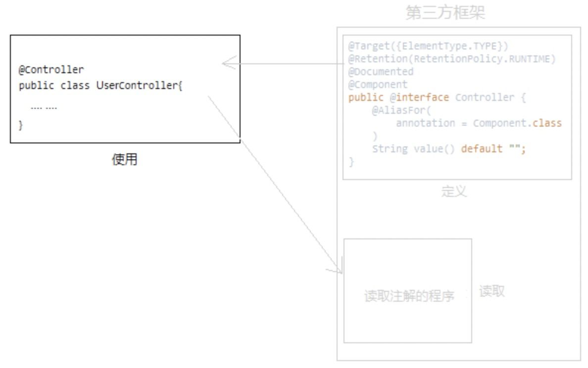

##注解的学习
1、Annotation通用定义
    @Documented
    @Target(ElementType.TYPE)
    @Retention(RetentionPolicy.RUNTIME)
    public @interface MyAnnotation1 {
    }
    
    @Deprecated  -- @Deprecated 所标注内容，不再被建议使用。
    @Override    -- @Override 只能标注方法，表示该方法覆盖父类中的方法。
    @Documented  -- @Documented 所标注内容，可以出现在javadoc中。
    @Inherited   -- @Inherited只能被用来标注“Annotation类型”，它所标注的Annotation具有继承性。
    @Retention   -- @Retention只能被用来标注“Annotation类型”，而且它被用来指定Annotation的RetentionPolicy属性。
    

    
    @Target      -- @Target只能被用来标注“Annotation类型”，而且它被用来指定Annotation的ElementType属性。
    @SuppressWarnings -- @SuppressWarnings 所标注内容产生的警告，编译器会对这些警告保持静默。

2、注解的格式：

    public @interface 注解名称{
        属性列表;
    }
3、注解的类型：
    自定义注解：
    JDK内置注解：
    第三方架构提供的的注解：

4、反射获取注解信息: 详见AnnotationTest
    注解就像一个标签，是贴在程序代码上供另一个程序读取的。
    可以反射获取类 字段方法上的注解，class method  Field上都有获取注解的方法
    
5、注解的三角关系：
    定义注解
    使用注解
    读取注解

6、元注解：加在注解上的注解。
    @Documented：用于制作文档，不是很重要，忽略便是
    @Target：加在注解上，限定该注解的使用位置。不写的话，好像默认各个位置都是可以的。
    @Retention（注解的保留策略）
    保留策略的意义：
        一般来说，普通开发者使用注解的时机都是运行时，
        比如反射读取注解（也有类似Lombok这类编译期注解）。
        既然反射是运行时调用，那就要求注解的信息必须保留到虚拟机将.class文件加载到内存为止。
        如果你需要反射读取注解，却把保留策略设置为RetentionPolicy.SOURCE、RetentionPolicy.CLASS，那就读取不到了。

 7、注解属性的数据类型 包括：value和数组
    八种基本数据类型
    String
    枚举
    Class
    注解类型
    以上类型的一维数组
    
8、value 属性
   如果注解的属性只有一个，且叫value，那么使用该注解时，可以不用指定属性名，因为默认就是给value赋值。
   但是注解的属性如果有多个，无论是否叫value，都必须写明属性的对应关系。

9、用常量类为注解属性赋值
   例如：
   方式一：
   
   方式二：
   

10、自定义Junit
   详见代码
   

##小结
.注解就像标签，是程序判断执行的依据。
  比如，程序读到@Test就知道这个方法是待测试方法，而@Before的方法要在测试方法之前执行。
.注解需要三要素：定义、使用、读取并执行
.注解分为自定义注解、JDK内置注解和第三方注解（框架）。自定义注解一般要我们自己定义、使用、
 并写程序读取，而JDK内置注解和第三方注解我们只要使用，定义和读取都交给它们
.大多数情况下，三角关系中我们只负责使用注解，无需定义和执行，框架会将注解类和读取注解的程序隐藏起来，
  除非阅读源码，否则根本看不到。平时见不到定义和读取的过程，光顾着使用注解，
  久而久之很多人就忘了注解如何起作用了！
 
 
 
 
 使用注解的目的就是通过反射获取到使用注解是传递的值。
 在框架中没有传递值也没有使用默认值的 可能是给了其他的定义
 例如：@Resource 使用的IOC用其中的类名

    
